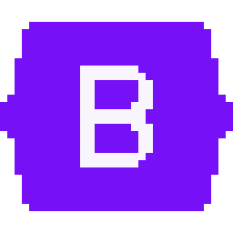
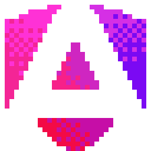
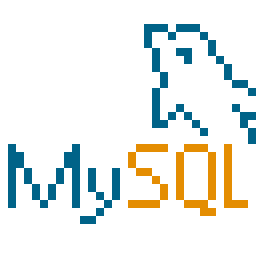
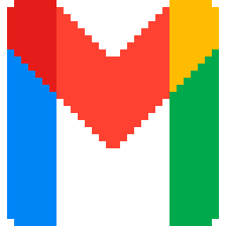

**Desenvolvedor Back-end Júnior — Java | Spring Boot**

  

- Estudante de **Análise e Desenvolvimento de Sistemas** na FEMA (conclusão em 2026)
- Foco em **back-end com Java e Spring Boot**
- Gosto de escrever código **simples, organizado e fácil de manter**
- Autor do **ConstruIdeias**, eleito o **melhor TCC da turma de Informática da Etec**

  

<b>LINGUAGENS</b>
  
&emsp;
&emsp;

  

<b>BACK-END</b>
  

  

<b>FRONT-END</b>
  
&emsp;
&emsp;
&emsp;

  

<b>BANCO DE DADOS</b>
  
&emsp;

  

<b>FERRAMENTAS</b>
  
&emsp;

  

#### [ConstruIdeias](https://github.com/LeonardoHenriqueTubero)

Plataforma web que conecta clientes a profissionais da construção civil. Trabalho de Conclusão de Curso da Etec, desenvolvido de forma autoral — do levantamento de requisitos à implementação.

- Sistema de autenticação completo e controle de sessão
- Banco relacional versionado em SQL
- 11 páginas em PHP
- Interface responsiva com Bootstrap 5

<picture>
  <source media="(prefers-color-scheme: dark)" srcset="https://raw.githubusercontent.com/LeonardoHenriqueTubero/LeonardoHenriqueTubero/output/github-snake-dark.svg">
  <source media="(prefers-color-scheme: light)" srcset="https://raw.githubusercontent.com/LeonardoHenriqueTubero/LeonardoHenriqueTubero/output/github-snake.svg">
  
</picture>

  

&emsp;

